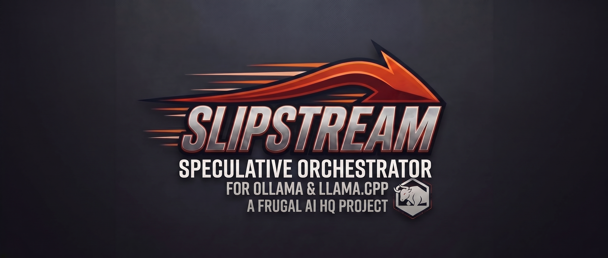

# Slipstream

> **Speculative Orchestrator**  
> **For Ollama and llama.cpp**  
> **A Frugal AI HQ Project**  
> **Made in Japan (日本製)**

---

## The Slipstream Manifesto: Zero CPU Offload

Slipstream is an inference orchestrator engineered for extreme-throughput speculative execution and deterministic multimodal reporting. To achieve these metrics, there is a single, non-negotiable operational law:

**You must maintain 100% VRAM residency.**

There is zero tolerance for CPU offloading. Both the model weights and the entire Key-Value (KV) cache must fit entirely on the GPU silicon. If your workload spills over the PCIe bus into system RAM, you are no longer running Slipstream; you are running a bottleneck.

### The Physics of the Bottleneck
The architecture of high-speed token generation is entirely bound by memory bandwidth. Modern GDDR6 GPU memory operates at speeds between 300 to 500+ GB/s. In contrast, DDR4 and DDR5 system memory tops out around 40 to 60 GB/s, and that data must be dragged across the latency penalty of the PCIe bus.

When you offload even a few layers to system RAM to run a slightly larger model, your entire generation loop is throttled down to the speed of your DDR sticks. Token generation instantly drops from 30+ tokens per second to a single-digit crawl. 

In speculative execution, where a draft model and a target model must synchronize rapidly, this PCIe latency is fatal. The entire draft-and-verify engine collapses under its own memory transfer overhead.

### The Law of Aggressive Quantization
Do not attempt to brute-force a Q8 model through system memory. 

If your target model does not fit natively on your VRAM, **step down the quant.** A Q4_K_M or Q3_K_M quant running completely resident on the GPU will utterly destroy the performance of a less-compressed model fighting for system RAM. Slipstream is designed to route and manage multi-GPU memory pools natively to maximize your available VRAM, but it will not save you from bad hardware allocation.

**If it doesn't fit on the card, you don't run it.**

---

## スリップストリーム・マニフェスト：CPUオフロード厳禁

Slipstream（スリップストリーム）は、極限のスループットを誇る投機的実行（Speculative Execution）と、決定論的なマルチモーダル・レポート生成のために設計された推論オーケストレーターです。これらの指標を達成するためには、絶対に妥協できない唯一の運用原則があります：

**100%のVRAM完全常駐を維持すること。**

CPUへのオフロードは一切許容されません。モデルの重み（Weights）とすべてのKVキャッシュは、完全にGPUシリコン上に収まる必要があります。ワークロードがPCIeバスを越えてシステムメモリ（RAM）に溢れた瞬間、あなたはSlipstreamを動かしているのではなく、単なるボトルネックを動かしていることになります。

### ボトルネックの物理的現実
高速なトークン生成のアーキテクチャは、メモリ帯域幅に完全に依存しています。最新のGDDR6 GPUメモリは300〜500+ GB/sの速度で動作します。対照的に、DDR4やDDR5のシステムメモリはせいぜい40〜60 GB/sで頭打ちになり、そのデータはPCIeバスの遅延ペナルティを引きずりながら転送されなければなりません。

少しでも大きなモデルを動かすために、数レイヤーだけでもシステムRAMにオフロードした場合、生成ループ全体がDDRメモリの速度まで引き下げられます。トークン生成速度は即座に30+ t/sから1桁台へと激減します。

ドラフトモデルとターゲットモデルが高速で同期しなければならない投機的実行において、このPCIe遅延は致命的です。ドラフト・検証エンジン全体が、自らのメモリ転送のオーバーヘッドによって崩壊してしまいます。

### 妥協なき量子化の法則
Q8モデルをシステムメモリ経由で力技で動かそうとしないでください。

ターゲットモデルがVRAMにネイティブに収まらない場合は、**量子化のレベルを下げてください。** GPU上に完全常駐するQ4_K_MやQ3_K_Mの量子化モデルは、システムRAMの帯域を奪い合う低圧縮モデルのパフォーマンスを完全に圧倒します。Slipstreamは、利用可能なVRAMを最大化するためにマルチGPUのメモリプールをネイティブにルーティングおよび管理するように設計されていますが、ユーザー自身の誤ったハードウェア割り当て（メモリ配置）から救い出すことはできません。

**VRAMに収まらないなら、動かさないこと。**

---

## Architecture & Hardware Economics

Most local AI workflows operate under an artificial hardware tax: practitioners looking to run 14B+ or 27B parameter multimodal models with meaningful context are pushed toward enterprise-grade accelerators or grossly inflated secondary-market consumer GPUs (such as the RTX 3060 12GB).

Slipstream is an air-gapped, containerized orchestration layer designed to dismantle vendor lock-in. Leveraging custom-compiled dynamic execution backends (`ggml-cuda` and `ggml-vulkan`), Slipstream dynamically partitions and streams model tensors across heterogeneous, mixed-vendor consumer GPUs. This unlocks large-scale local multimodal inference on salvage, budget, or repurposed desktop silicon.

### Cost Comparison (Secondary / Salvage Market)

Rather than sinking an entire budget into a single mid-range graphics card, the same capital can assemble an entire standalone, multi-GPU compute node delivering **14GB to 16GB of addressable VRAM.**

| Component | Single-GPU Baseline (RTX 3060 12GB) | Complete Slipstream Node (Dual-GPU Array) |
| :--- | :--- | :--- |
| **GPU(s)** | 1x NVIDIA RTX 3060 12GB (¥42,000) | 1x AMD RX 580 8GB + 1x GTX 1660 Super 6GB (¥9,000)* |
| **Motherboard** | — | ASUS Z170-PRO (LGA1151, Dual PCIe) (¥4,000) |
| **Processor** | — | Intel Core i7-6700K (¥4,000) |
| **Memory** | — | 16GB DDR4 RAM (¥11,000) |
| **Storage (OS/Swap)** | — | 128GB SATA SSD (¥4,000) |
| **Storage (Models)** | — | 2TB SATA HDD (¥4,000) |
| **Power & Chassis** | — | 850W Corsair PSU + Antec P180 Case (¥5,440) |
| **Total Investment** | **~¥42,000 (~$275 USD)** | **¥41,440 (~$270 USD)** |
| **Total Available VRAM** | **12 GB** | **14 GB to 16 GB** |

*\*Note 1: Configuring with two AMD RX 580 8GB cards achieves 16GB total VRAM at an identical or lower price point.*  
*\*Note 2: Retail pricing for brand-new RTX 3060 12GB cards has reached between ¥75,000 and ¥85,000, widening the value gap even further.*

---

## アーキテクチャとハードウェア経済性

多くのローカルAI運用環境は、不当な「ハードウェア税」を強いられています。十分なコンテキスト長を維持したまま14Bや27Bクラスのマルチモーダルモデルを動作させるために、開発者は高額なエンタープライズ向けGPUや、二次流通市場で価格が高騰したコンシューマーカード（RTX 3060 12GBなど）の購入を迫られてきました。

Slipstreamは、特定ベンダーへの依存（ベンダーロックイン）を排除するために設計された、完全隔離型・コンテナ化推論オーケストレーションレイヤーです。独自ビルドされた動的実行バックエンド（`ggml-cuda` および `ggml-vulkan`）を駆使し、メーカーの異なる異種混合（NVIDIA / AMD）コンシューマーGPU間でモデルテンソルを動的に分割・ストリーミングします。これにより、型落ちPCや中古・リユース品、低予算デスクトップ環境であっても、大規模なローカルマルチモーダル推論の実行が可能になります。

### コスト比較（中古・リユース市場ベース）

単一のミドルレンジGPUに予算を全額投入する代わりに、全く同じ資金で**14GB〜16GBの実効VRAM**を備えた完全自立型のマルチGPU計算ノードを1台丸ごと構築できます。

| 構成コンポーネント | 単一GPU導入ベースライン (RTX 3060 12GB) | Slipstream完全ノード (デュアルGPU構成) |
| :--- | :--- | :--- |
| **GPU** | 1x NVIDIA RTX 3060 12GB (¥42,000) | 1x AMD RX 580 8GB + 1x GTX 1660 Super 6GB (¥9,000)* |
| **マザーボード** | — | ASUS Z170-PRO (LGA1151, Dual PCIe) (¥4,000) |
| **CPU** | — | Intel Core i7-6700K (¥4,000) |
| **メモリ** | — | 16GB DDR4 RAM (¥11,000) |
| **ストレージ (OS/Swap)** | — | 128GB SATA SSD (¥4,000) |
| **ストレージ (モデル格納)** | — | 2TB SATA HDD (¥4,000) |
| **電源 & 筐体** | — | 850W Corsair PSU + Antec P180 ケース (¥5,440) |
| **総投資額** | **約 ¥42,000** | **¥41,440** |
| **利用可能 VRAM** | **12 GB** | **14 GB 〜 16 GB** |

*\*注記1: AMD RX 580 8GBの2枚差し構成を採用した場合、同等以下のコストで合計16GBのVRAMを確保可能です。*  
*\*注記2: 新品RTX 3060 12GBの実勢小売価格は75,000円〜85,000円前後まで跳ね上がっており、単一パーツ購入の費用対効果の悪さはさらに顕著になっています。*

---

## Deployment & Usage

Slipstream is distributed strictly as a self-contained runtime bundle containing pre-compiled binaries and orchestration scripts. No raw source code is required or provided.

### Prerequisites
Slipstream is an orchestration layer designed to interface with your existing local inference engine. 
* **Ollama** must be installed and running natively on your host machine (`localhost`) before launching the Slipstream container.


### Installation

1. Download the latest `slipstream-VERSION.tar.gz` payload from the [Releases](https://github.com/Slipstream-llm/Slipstream/releases) page.

2. Extract the archive into your desired directory:

   ```bash
   tar -xzf slipstream.tar.gz
   cd slipstream
   ```

3. Launch the orchestrator using the provided wrapper script:

   ```bash
   ./start-slipstream.sh
   ```


*(This will automatically execute the necessary `docker compose` commands and build the local container using the binary payload).*


### Service Endpoint

Once initialized, the orchestrator exposes its Ollama-compatible and OpenAI-compatible inference endpoint directly on your host machine:

- Endpoint URL: http://localhost:7777

- Verification Ollama-compatible:

   ```bash
   curl http://localhost:7777/api/tags
   ```

- Verification OpenAI-compatible:

   ```bash
   curl http://localhost:7777/v1/models
   ```


### Command Line Options

For a full list of runtime arguments, utility flags, and configuration overrides, use the built-in help menu:

```bash
./start-slipstream.sh --help
```


### Advanced Configuration (Environment Variables)

Slipstream is designed to work out-of-the-box with standard default paths, but it can be dynamically configured using environment variables. You can export these variables in your shell before launching, or pass them inline with the start script.

*   **`OLLAMA_MODELS`**: Overrides the default model directory. Use this if your `.gguf` files are stored on a separate drive or non-standard path rather than the default `~/.ollama/models`.
    *   *Example:* `OLLAMA_MODELS=/mnt/nvme/models ./start-slipstream.sh`
*   **`SLIP_OLLAMA_PORT`**: Instructs Slipstream to bind to a custom Ollama host port if your base inference engine is not running on the default `11434`.
    *   *Example:* `SLIP_OLLAMA_PORT=11435 ./start-slipstream.sh`
*   **`SLIP_QUIRK`**: Activates specialized orchestration routing for specific hardware edge cases or complex multi-vendor setups (such as custom memory pooling for AMD Radeon Pro V620 arrays).
    *   *Example:* `SLIP_QUIRK=v620 ./start-slipstream.sh`


### Upgrading

To install a new release, cleanly remove the old runtime environment and force a rebuild with the new payload:

```bash
./stop-slipstream.sh
cd ..
rm -rf slipstream
# Extract the new slipstream.tar.gz here, then:
cd slipstream
./start-slipstream.sh --build
```


